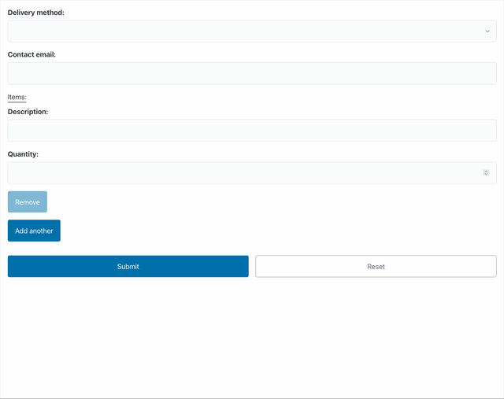

# nestingdolls

Django's ordinary form fields are good for flat data, but fall _**flat**_ (hah!)
as soon as you might want any nesting, forcing instead toward separate formset 
configuration and orchestration. It'd be nicer if it were simpler, and more
declarative...

You know that thing where a form has collected an address, an order, or a
schedule, then hands you a flat dictionary and says, good luck with that?
It works, but the awkward part is that your application has to put the related 
keys back together.

`django-nestingdolls` does that bit for you. `DictField` renders and cleans a
child Django `Form`, then returns its cleaned values as one `dict`. `ListField`
renders formset-shaped rows for one child Django `Field`, then returns their
cleaned values as one `list`. The outer form gets the value it was describing
in the first place.

The child forms and fields still do the grown-up work: widgets, type
conversion, validation, file uploads, and errors. These fields just make sure
the bits that belong together don't wander off and become loose keys.

## A micro example

Here's a small snapshot of how simple it is, with a form which allows for 
multiple subforms:

```python

# normal Django form!
class LineItemForm(forms.Form):
    description = forms.CharField()
    quantity = forms.IntegerField(min_value=1)


class ListOfMappingsForm(forms.Form):
    # normal Django field
    delivery_method = forms.ChoiceField(choices=[("standard", "Standard"), ("express", "Express")])
    # normal Django field
    contact_email = forms.EmailField()
    # here's our special magic new fields!
    items = nestingdolls.ListField(nestingdolls.DictField(LineItemForm), min_length=1, max_length=5)
```

and that small definition gives us:



(this example is taken from the git repository's `demo.py`)

## Install

`django-nestingdolls` expects Python 3.12+ and Django 5.2+.

```sh
python -m pip install django-nestingdolls
```

or add it to your `pyproject` and `uv sync` or whatever, poetry? pdm? you
do you.

### Setup

Then add the app to your Django settings module:

```python
INSTALLED_APPS = [
    # ...
    'nestingdolls',
]
```

That's the whole thing, hopefully. Django's normal DTL form renderer finds 
the package templates and the matching composite wrappers for the  `as_div()`, 
`as_p()`, `as_table()`, and `as_ul()` form helpers.

The app setup also makes composite wrappers follow Django's form-helper
layout. [Why that needs a patch](#the-render-patch).

## A quick tutorial

Let's make a `CheckoutForm`. The browser will send ordinary Django input
names; the finished form will hand us one nested `order` dictionary with
integer product IDs and quantities. Nice and tidy.

### Describe the order

Start small: a line item has two named values. An order has a customer ID and
as many of those items as it needs. Put the forms together like this:

```python
from django import forms

import nestingdolls


class LineItemForm(forms.Form):
    product_id = forms.IntegerField(min_value=1)
    quantity = forms.IntegerField(min_value=1)


class OrderFieldsForm(forms.Form):
    customer_id = forms.IntegerField(min_value=1) # Obviously not really :)
    items = nestingdolls.ListField(
        nestingdolls.DictField(LineItemForm),
        min_length=1,
    )


class CheckoutForm(forms.Form):
    order = nestingdolls.DictField(OrderFieldsForm)
```

`LineItemForm` checks products and quantities. `OrderFieldsForm` checks the
customer and item list. `CheckoutForm` gets one `order` value back, not a
scavenger hunt through keys that merely look like they are related.

### Bind browser data

Browsers only send strings, and nested child fields get prefixed names.
Sequence rows bring Django's usual formset management values along too. Here is
what a complete two-item submission looks like:

```python
from django.http import QueryDict

# This is the data the user submitted for their order form from the 
# previous section above.
submission = QueryDict(
    'order-customer_id=17&'
    'order-items-TOTAL_FORMS=2&'
    'order-items-INITIAL_FORMS=0&'
    'order-items-MIN_NUM_FORMS=0&'
    'order-items-MAX_NUM_FORMS=1000&'
    'order-items-0-product_id=42&'
    'order-items-0-quantity=2&'
    'order-items-1-product_id=73&'
    'order-items-1-quantity=1'
)

form = CheckoutForm(submission)

assert form.is_valid()
assert form.cleaned_data == {
    'order': {
        'customer_id': 17,  # example only :D
        'items': [
            {'product_id': 42, 'quantity': 2},
            {'product_id': 73, 'quantity': 1},
        ],
    }
}
```

See the hand-off? `IntegerField` turns `order-items-0-quantity` from a request
string into an integer. `CheckoutForm` then returns one `order` value ready for
order code. No reconstruction helper, properly nested into conceptual
namespaces, less hunting around hopefully.

### Render it

Render it with Django's normal form helpers:

```django
<form method='post'>
  
  {{ form.media }}
  {{ form.as_div }}
  <button type='submit'>Place order</button>
</form>
```

`form.media` loads `nestingdolls/sequence.js`, so people can add and remove
item rows without a reload. Kinda like in the Django admin inlines. Django
still names the controls, builds the rows, and does all the validation on
submitted values.

## Show a saved order again

Give `initial` the nested Python value you saved, not prefixed browser names:

```python
saved_order = {
    'customer_id': 17,
    'items': [
        {'product_id': 42, 'quantity': 2},
        {'product_id': 73, 'quantity': 1},
    ],
}

form = CheckoutForm(initial={'order': saved_order})
```

`order-items-0-product_id` is an HTTP submission name. It only exists after
Django has rendered and named real controls. `initial` wants ordinary Python
data, from before that whole naming circus starts.

## More ways to use the fields

The checkout example follows the full browser path. The same fields should also
provide value at other boundaries: an API, an import job, or a background
worker.

### Bind decoded application data

Got data from an API client or worker? Hand over the saved order directly.
Unlike `initial`, this is a submission, so Django validates it and puts it in
`cleaned_data` with everything else.

```python
form = CheckoutForm({'order': saved_order})

assert form.is_valid()
assert form.cleaned_data['order'] == saved_order
```

### Validate an imported JSON, YAML, or CSV list

Decode the import to normal Python data first. Then let the child field do its
thing: convert and validate every value.

```python
import csv
import json

import yaml


class ProductImportForm(forms.Form):
    product_ids = nestingdolls.ListField(forms.IntegerField(min_value=1))


json_form = ProductImportForm(json.loads('{"product_ids": [42, 73]}'))
yaml_form = ProductImportForm(
    yaml.safe_load('product_ids:\n  - 42\n  - 73')
)
# The list could come from a csv.DictReader row etc. too.
csv_form = ProductImportForm({'product_ids': next(csv.reader(['42,73']))})

for form in (json_form, yaml_form, csv_form):
    assert form.is_valid()
    assert form.cleaned_data['product_ids'] == [42, 73]
```

Use `yaml.safe_load`, not `yaml.load`.

### Constrain a repeated field

Use `min_length` and `max_length` when a list needs a useful range, not just
any number of rows.

```python
class TeamForm(forms.Form):
    member_ids = nestingdolls.ListField(
        forms.IntegerField(min_value=1),
        min_length=1,
        max_length=10,
    )
```

A submitted list of one through ten valid IDs cleans normally. More than ten
gets a validation error.

### Return a frozenset or another domain value

You don't have to settle for a mutable `list` or `dict` for your cleaned
value. 

Use `FrozenSetField` when repeated values should be unique and stay immutable.
`TupleField`, `DataclassField`, and `NamedTupleField` make the other return
shapes in this example; see the [field reference](#the-fields-included) for
their parameters. 

```python
from dataclasses import dataclass
from typing import NamedTuple


@dataclass
class Dimensions:
    width: int
    height: int


class Limits(NamedTuple):
    low: int
    high: int


class DimensionsForm(forms.Form):
    width = forms.IntegerField(min_value=1)
    height = forms.IntegerField(min_value=1)


class LimitsForm(forms.Form):
    low = forms.IntegerField()
    high = forms.IntegerField()


class PreferencesForm(forms.Form):
    pinned_product_ids = nestingdolls.FrozenSetField(forms.IntegerField())
    dimensions = nestingdolls.DataclassField(DimensionsForm, output=Dimensions)
    limits = nestingdolls.NamedTupleField(LimitsForm, output=Limits)


form = PreferencesForm(
    {
        'pinned_product_ids': [42, '73', 42],
        'dimensions': {'width': '10', 'height': 20},
        'limits': {'low': 1, 'high': '5'},
    }
)

assert form.is_valid()
assert form.cleaned_data['pinned_product_ids'] == frozenset({42, 73})
assert form.cleaned_data['dimensions'] == Dimensions(width=10, height=20)
assert form.cleaned_data['limits'] == Limits(low=1, high=5)
```

## Keep uploads with their row

When a repeated row has ordinary values and an upload, make that row a child
form. Then bind it the normal multipart way:

```python
class AttachmentForm(forms.Form):
    description = forms.CharField()
    document = forms.FileField()


class EvidenceForm(forms.Form):
    attachments = nestingdolls.ListField(
        nestingdolls.DictField(AttachmentForm),
        min_length=1,
    )


form = EvidenceForm(request.POST, request.FILES)
```

Render it with `enctype='multipart/form-data'`. `FileField` handles the
upload; the list field keeps every file beside its description. They arrived
together, so they can leave together.

## The fields included

As mentioned at the beginning, high level, the 2 basic building blocks are 
[`DictField`](#dictfield) (for nested  key/value shaped data) and 
[`ListField`](#listfield) (for "up to N of this field" data) and everything 
else is a variant of those.

### `DictField`

Renders and cleans a child `Form`, returning its cleaned values as a `dict`
by default.

Should you prefer, you can also use `FormField` or `Subform` or `MappingField`
(they're all aliases for the same thing).

| Parameter | What it does |
| --- | --- |
| `form_class` | The child Django `Form` class that supplies the named fields. |
| `output` | A callable that turns the cleaned child values into the returned value; defaults to `dict`. |

### `NamedTupleField`

A subclass of the `DictField` which returns a `NamedTuple` instance instead.

| Parameter | What it does |
| --- | --- |
| `form_class` | The child Django `Form` class that supplies the named fields. |
| `output` | The `NamedTuple` class used to build the returned value. |

### `DataclassField`

Like the `NamedTupleField` above, it's a subclass of the `DictField` but
it returns a `dataclass` instance. Shocking, I'm sure.

| Parameter | What it does |
| --- | --- |
| `form_class` | The child Django `Form` class that supplies the named fields. |
| `output` | The dataclass used to build the returned value. |

### `ListField`

Renders and cleans any number of one child field, returning the cleaned rows as
a list. Basically the approximate equivalent of a formset, but without the
ceremony of handling it separately.

Also available as `SequenceField`.

| Parameter | What it does |
| --- | --- |
| `child_field` | The Django field repeated for every row. |
| `min_length` | The fewest cleaned rows allowed. |
| `max_length` | The most cleaned rows allowed. |
| `absolute_max` | The hard cap on submitted rows, including rows Django must reject before cleaning. |

### `TupleField` (`FrozenSequenceField`)

Your standard `ListField`, but returns an immutable tuple.

| Parameter | What it does |
| --- | --- |
| `child_field` | The Django field repeated for every row. |
| `min_length` | The fewest cleaned rows allowed. |
| `max_length` | The most cleaned rows allowed. |
| `absolute_max` | The hard cap on submitted rows, including rows Django must reject before cleaning. |

### `SetField`

A `SequenceField` which returns a set and keeps each cleaned value once.

| Parameter | What it does |
| --- | --- |
| `child_field` | The Django field repeated for every row. |
| `min_length` | The fewest cleaned values allowed after duplicates are removed. |
| `max_length` | The most cleaned values allowed after duplicates are removed. |
| `absolute_max` | The hard cap on submitted rows, including rows Django must reject before cleaning. |

### `FrozenSetField`

It's the same as `SetField`, but giving back an immutable `frozenset` instead.

| Parameter | What it does |
| --- | --- |
| `child_field` | The Django field repeated for every row. |
| `min_length` | The fewest cleaned values allowed after duplicates are removed. |
| `max_length` | The most cleaned values allowed after duplicates are removed. |
| `absolute_max` | The hard cap on submitted rows, including rows Django must reject before cleaning. |


## Design notes

### The render patch

Django knows whether `form.as_p()` or `form.as_table()` is rendering a form,
but it does not tell the widget. The app installs a small wrapper around
`BaseForm.render`, `__str__`, and `__html__` so composite wrappers can choose
the matching layout. Custom form templates go straight through Django's usual
rendering path.

### On set behaviour...

`SetField` and `FrozenSetField` turn cleaned rows into a set before checking
the length. Two `42`s are one value, not two. They also compare membership
without caring about row order: the same set in a different order is still the
same set.

### JavaScript helpers for `SequenceField`

It emits bubbling
`nestingdolls:sequence-ready`, cancelable `nestingdolls:sequence-add` and
`nestingdolls:sequence-remove`, and after-the-fact
`nestingdolls:sequence-change` events. You should listen for those and make 
something happen that that fits your page, maybe it's a toast or counter or 
something? I dunno!

`preventDefault()` stops an add or removal.

If your page replaces sequence markup after it loads, dispatch
`new Event("nestingdolls:sequence-enhance")` on `document` after insertion.
The helpers rescan the document and enhance the new sequence widgets.

